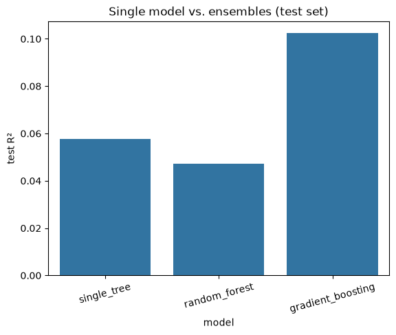

# Project Documentation

This site provides project documentation.
Use the documentation navigation to explore.

## How-To Guide

Many instructions are common to all our projects.

See
[⭐ **Workflow: Apply Example**](https://denisecase.github.io/pro-analytics-02/workflow-b-apply-example-project/)
to get the example projects running on your machine.

## Project Documentation Pages (docs/)

- **Home** - this documentation landing page
- [**Project Instructions**](./project-instructions.md)  - the standard project workflow
- [**Your Files**](./your-files.md) - how to copy the example and create your version
- [**Glossary**](./glossary.md) - project terms and concepts
- [**API**](./api.md) - autogenerated code documentation for the public project interface

## Phase 4. Technical Modification

For Phase 4, I decided to make an easy modification and change the Decision Tree's `max_depth`
from 3 to 5. This change was made to see if allowing the model to make more decision splits
would improve its classification performance. The test accuracy changed from 0.986
in the example model to 1.0 in Phase 4, which means making the Decision Tree more complex
gave it more flexibility to identify patterns in the Penguins Dataset. This matters because a
tree that is too shallow may underfit the data, while a tree that is too deep may overfit the data.

## Phase 5. Custom Project

Changes for Phase 5 include:

- Copying `ml_05_ensembles_p4.ipynb` and renaming it `ml_05_ensembles_p5.ipynb`
- Added `medical_cost_prediction_dataset.csv` from Kaggle to the `data/raw` folder
- Imported that dataset into `ml_05_ensembles_p5.ipynb`
- Made `annual_medical_cost` the target
- Made `previous_year_cost`, `age`, `bmi`, `doctor_visits_per_year`, `hospital_admissions`,
  and `medication_count` as the features
- Used Decision Tree, Random Forest, and Gradient Boosting regressions
- Used MAE, RMSE, and R2 to score each model and plot the results
- Included an Actual vs. Predicted plot
- Printed the results

### Basis and Data

The example project in `notebooks/ml_05_ensembles.ipynb` had an intended target `species`
from the Seaborn Penguins dataset. I decided to use the workflow and apply it to the
Medical Cost Prediction dataset I imported from Kaggle. I chose this dataset because this
dataset provides a realistic regression problem where multiple factors can contribute to
a continuous numerical outcome.

One limitation is that the available features may not contain enough information to
accurately predict an individual's annual medical costs. There are many factors that
can affect medical expenses that are not represented in this dataset.

### Modeling Approach

This project is a supervised machine learning regression problem because the chosen
target is numerical. These models use `previous_year_cost`, `age`, `bmi`,
`doctor_visits_per_year`, `hospital_admissions`, and `medication_count` as predictor
variables to predict a patient's annual medical costs.

I compared three regression models:

- Decision Tree Regressor: single-model baseline
- Random Forest Regressor: ensemble model; combines predictions from 200 decision trees
- Gradient Boosting Regressor: ensemble model; builds trees sequentially with later
trees attempting to improve on errors made by earlier trees

### Target

The example target variable, `species`, is a categorical target that required classification.
The target variable, `annual_medical_cost`, represents a patient's annual medical cost
in dollars. This changed the model from classification to regression.

The evaluation metrics were also changed in this model. Instead of classification accuracy,
I evaluated the models using `Mean Absolute Error (MAE)`,`Root Mean Squared Error (RMSE)`,
and `R²`.

### Features

The original example used `bill_length_mm`, `bill_depth_mm`, `flipper_length_mm`,
and `body_mass_g` to predict `species`. My project used `previous_year_cost`, `age`,
`bmi`, `doctor_visits_per_year`, `hospital_admissions`, and `medication_count` to predict `annual_medical_cost`.

In Module 4, I had previously used a smaller feature set containing `previous_year_cost`, `age`,
and `bmi`. For this module, I wanted to expand by adding `doctor_visits_per_year`, `hospital_admissions`,
and `medication_count`.
These were added because they represent healthcare utilization and may provide additional information
about annual medical expenses.

### Evaluation and Results

I evaluated all three models using the same held-out test set. This allowed me to evaluate and compare
their performance fairly.

The evaluation metrics were as follows:

- `MAE`: measures the average absolute difference between predicted and actual medical costs (lower values are better)
- `RMSE`: measures prediction error while giving greater weight to larger errors (lower values are better)
- `R²`: measures how well the model explains variation in the target (higher values are better)

The results were:

| Model                       | MAE       | RMSE      | R²    |
| --------------------------- | --------- | --------- | ----- |
| Single-Tree Regressor       | $5,139.61 | $6,779.77 | 0.058 |
| Random Forest Regressor     | $5,266.71 | $6,817.12 | 0.047 |
| Gradient Boosting Regressor | $5,031.15 | $6,616.95 | 0.102 |

The best-performing model was Gradient Boosting Regressor based on all three metrics.
It had the lowest `MAE`, the lowest `RMSE`, and the highest `R²`. This means the Gradient Boosting
model's predictions were off by approximately $5,031 and explained about 10.2% of the variation in annual medical costs.

It was interesting to see that the Random Forest did not improve on a single Decision Tree. It demonstrated
that using an ensemble does not automatically produce better results.

An additional improvement would be to include additional predictors such as chronic health conditions or insurance information.

### Summary

For this project, I customized the original example by importing a Kaggle dataset on medical costs. The features
`previous_year_cost`, `age`, `bmi`, `doctor_visits_per_year`, `hospital_admissions`,
and `medication_count` were used to predict `annual_medical_cost`. A Decision Tree Regressor was
implemented as a baseline and compared with two ensemble methods: Random Forest Regressor and Gradient
Boosting Regressor. All three models were trained and tested on the same held-out test data using `MAE`,
`RMSE`, and `R²`. Gradient Boosting Regressor was the best-performing model with an `MAE` of $5,031.15,
an `RMSE` of $6,616.95, and an `R²` of 0.102. This project helped me understand how ensemble methods
can be applied to regression problems and how model performance should be evaluated using multiple metrics.
I also learned that feature selection has an important effect on model performance. These skills could be applied to real-world problems such as hospital resource utilization,
insurance cost, and patient demand.
